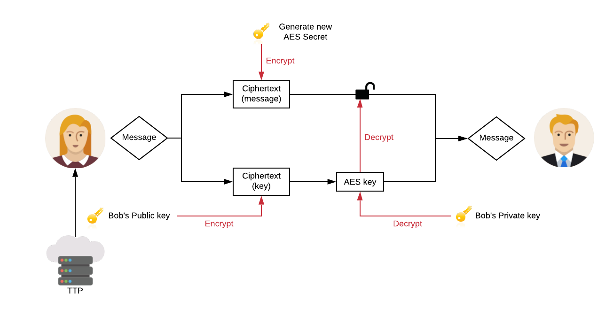

# SecureChat2020
Secure Chat app for Secure Programming 2020 course

### NOTE: In case of the functionality tests failing, please consider rerunning the tests a second time. 
### NOTE: Please see README.pdf for a version that contains descriptive figures that complement the documentation.

# Documentation
The underneath text forms the documentation of the SecureChat program developed for the Secure Programming course of the Deep Programming minor academic year '20/'21. The software is developed in C. All functionality and design decisions are documented in here and are structured as follows:

	1. Architecture
	2. Server program
	3. Client program

## 1. Architecture
The software in its current state is structured as shown in figure 1. The figure shows roughly how the communication is set up in its current state. It consists of a the following components:

	1. Clients
	2. Workers
	3. Server
	4. SQLite3 Database

The server functions as a central point of communication between these components. It handles all incoming and outgoing messages and stores these in the SQLite3 database, so that they may be recalled whenever required. Once a client connects to the server by providing its address and port (see section 2 on the client program for usage), a worker process is forked off by the server to ensure the possibility of multiple clients. This worker process handles all communication with an individual client. For more information on the client to worker and worker to server communication, please see section 2 and 3 on the server and client programs. 


*Figure 1 - Software Architecture (updated 30-11-2020)*

There are different types of communication present within this architecture, which can be described as follows:

Communication Type | Description
-------------------|-------------
Client <-> worker  | Communication over TCP socket
Worker <-> server  | Communication over File Descriptors
Server <-> database| Communication using SQL queries


## 2. Server Program
```
Usage:
	./server <port>
```

The server program serves as a central point of communication within the architecture. It is responsible for managing all incoming and outgoing communication and allows multiple clients to talk to each other over a centralized instance. While it does not handle incoming client messages directly itself, it is responsible for spawning new worker processes, enabling multiple workers to communicate with eachother, creating the database and so on. The server allows a total of 16 clients at once.

### 2.1 Worker Processes
As mentioned, the server is responsible for spawning worker processes that handle the incoming and outgoing client communication. Every time a client connects to the server address, the server forks off a child process that becomes a worker. This worker can communicate with the client over a TCP socket. Whenever the client sends a command or message, the worker process that corresponds to the sending client receives the message or command over the socket using the `api_recv()` function, after which it is executed appropriately using the `execute_request()` function (file `worker.c line 133`). This includes (but is not limited to) logging in, registering users and handling regular messages.

Whenever a regular message is received, the worker does not communicate this message directly with the server. Instead, it stores the message in the SQLite3 database with the `process_global()` function (file `worker.c line 72`) and notifies the server using the `notify_workers()` function (file `worker.c line 53`) by writing over the bidirectional channel (file descriptor) that is set up between the server and worker process for notifications. The server in turn responds to this notification by setting the `pending` bit in a separate struct created for each worker process that is located in `server.c`. Each worker responds to this notification by executing the `handle_s2w_notification()` function (file `worker.c line 30`), in which they request the latest message in the database with an SQL query, of which the result is written back over the client's socket.


*Figure 2 - Communication Cycle*

### 2.2 Creation of the database
In order for the workers to store messages in the database, the server must create this database if it does not exist yet. For now, this is done in the `main()` function of `server.c (line 372)`. The filename of the database is `chat.db` and consists of a table called `global_chat` with the following columns:

	- id (primary key)
	- Message

In the future, this could be expanded using a separate column for timestamp, username (foreign key) and chat ID (foreign key). The desired database layout is shown in figure 3 and allows for added security by salting user passwords if a separate user table is made and separate chat logs such as private chat messages.


*Figure 3 - Database Setup*
 

## 3. Client Program
```
Usage:
	./client <server address> <server port>
```

The client program can be used by a user to connect to the server and send messages to other users. It does so by connecting to the server with a TCP socket, unaware of the presence of the worker processes. Its only concern is parsing user commands, writing its message over the socket and handling the response. In the future, an extra task will be added which involves the storing of other client's public keys for use. This is due when cryptography is implemented. Communication with the workers is done through the API-interface provided by the framework, which allows the client to store information about the message and send this to the server.

### 3.1 Command Parsing
For the parsing and handling of user commands, the client uses the file `ui.c`. This file contains all the possible user commands (also listed in table 1) and performs the necessary checks before executing them. Right now, the functionality supports registering and logging in users, sending private messages, retrieving all online users and exiting the client. Furthermore, empty messages are not allowed and a user is not allowed to send messages before being logged in.

Command | Description
--------|-------------
/login <username> <password> | Allow the user to log in
/register <username> <password> | Allow the user to register a new account, user is logged in automatically after registering
/users | Prints the amount of online users
/exit | Exits the client program
@user | Prefix for sending a private message to user

## 4. Security
There are several security implementations in place. The most important of these are the encryption scheme for sending messages, input sanitization using regular expressions, the encryption of private messages in the database and hashing and salting of passwords. These security measures will be discussed in more detail in the next section.

### 4.1 Vulnerability backlog
- [x] Fix the SQL Injection vulnerability by parameterizing the query at `worker.c line 91`.
- [x] Fix the double free bug in `worker.c`.
- [x] Fix the nullbyte injection vulnerability in `worker.c`.
- [x] Fix the buffer overflow vulnerability on client input and worker handler with bounds-checking.
- [x] Add rate limits to the login and messaging mechanisms.
- [ ] Fix all memory leaks in client and server.
- [x] Solve command injection vulnerability in TTP connection. 
- [x] Prevent users from connecting using Netcat or Telnet to bypass client functionality.

# Assignment 1.B documentation (updated 30-11-2020) - Security by Design

## Use of Encryption
In the below image, an overview is given of the earlier presented architecture in combination with the applied encryption. There are, wherever required, two types of encryption used; a hybrid encryption scheme and an asymmetric encryption scheme. The hybrid encryption scheme is used for the messaging protocol and utilizes RSA (asymmetric) and AES (symmetric) to mitigate the overhead of using RSA only. Communication regarding key management can be done with asymmetric encryption only. For added data safety, private messages have been stored in the database using the same asymmetric encryption scheme (using the public key of the recipient). The server stores this without ever seeing the content of the message, meaning there is no opportunity of forging or modifying private messages by a compromised server as all they will process is the ciphertext.


*Figure 4 - Applied Cryptography*

Section 1 on the architecture already displayed a few types of communication. The above figure applies the required cryptography scheme to each communication type. The legend shows which type is being used between the components. 

**NOTE: due to some last-minute memory errors regarding the private message encryption, we have not been able to implement this. However, the working encryption and decryption methods can be found in `util.c`.**

### Hybrid Encryption
First, the hybrid encryption scheme between client and worker is discussed. A hybrid encryption scheme is implemented by generating a symmetric key and symetrically encrypting the message. Reuse of the symmetric keys is not allowed, meaning every message requires the generation of a new AES-secret (symmetric key). Then, the recipient's public key (obtained from the TTP) is used to encrypt this symmetric key, after which the encrypted message and the encrypted symmetric key are sent to the recipient. This overcomes the fact that RSA can only encrypt limited-size messages, creates some overhead in size after encryption and thus can be relatively expensive on small architectures. This type of encryption will be used for client to server or client to client communication. The way in which this hybrid encryption scheme will be implemented is an SSL implementation.


*Figure 5 - Hybrid Encryption Scheme*

#### Difference between Public and Private messages
Users should be able to send public and private messages. This is implemented in two ways; during the sending of a message, the worker checks if the message is prefixed by an @-sign and a username. If this is the case, the included message is encrypted using the recipients public key and can therefore not be read. This means the message will be forwarded to the intended recipient and the ciphertext will be stored in the database. If the command does not start using the @-sign, it is a public message. When retrieving the chat history, distinction between public and private messages is made by checking whether or not the message has a recipient. If the recipient is NULL, it means the message is public. If not, the message is private.

### Asymmetric Encryption
Secondly, the asymmetric encryption scheme should be discussed. The reason that asymmetric encryption is chosen here, is because the key communication is mostly fixed and only has to make sure that the returned key by the TTP (or client/server) cannot be replaced or modified in transit. 

#### Obtaining Other Public Keys
The TTP can be asked for another client's public key. The TTP will provide the client's certificate, which is used to extract the public key. This way, the (right) trusted public key is ensured. 

### No Encryption
Thirdly, some communication channels have no encryption. This is regarding the database connection and server/worker connection. This communication is not done through the transmission of data, hence, there is no encryption required for data in transit. The workers are merely forked child processes of the server and the database is accessed directly through SQL queries.
 
### Database Security
While data has to be secured in transit, it also has to be secured in rest. Or at least the sensitive parts of the data. This is why the sensitive information in the database, such as passwords, should be salted and hashed with the SHA-256 algorithm. We refrain from using slow hashes because we are of opinion that salting in combination with the SHA-256 algorithm is sufficient security and does not require the extra security coming with the performance overhead of a slow hash.

### Verifying Message Authenticity
It is important to ensure the confidentiality and integrity of a message, but sometimes, the authenticity of a message needs to be verified. This can be done using signature verification (not shown in the figure). Before sending the message, the sender hashes the message and encrypts it with their private key. Then, the message (including the digital signature) is sent to the recipient, who may verify the sender by hashing the obtained message and decrypting the signature with the recipients public key. If the resulting hashes match, the sender is verified. This is implemented for all client to client communication. Right now, this is not yet implemented in the solution.

### Sender Verification
In order to verify the identity of a sender or the server, the TTP can be leveraged. During the creation of keys, the TTP will create a signing request and a certificate for the client for which it creates keys. Since the TTP is the authority on providing the keys, the TTP decides whether the keys are valid or not. Hence, this can be verified using the certificates. In order to verify a public key, the TTP's signature and the certificate signature can be verified. Other steps that can be taken is by checking whether the dates on the certificate are still valid and whether or not the key has been revoked. Right now, this is only partially implemented. In the current implementation, public keys are verified by taking them from the TTP-provided certificate and checking whether the certificate is still valid based on the dates.

## Key Management
In order to enable different parties to communicate with each other securely, some form of key management has to be achieved. This is done using a Trusted Third Party (TTP). This TTP is responsible for keeping all the public keys linked to users. Every connected party will be able to approach the TTP, ask for a certain public key (or ask it to verify), and use this public key to communicate with the user which has the corresponding private key. The TTP is a bash-script that clients and the server can directly communicate with. This communication is direct as this creates less overhead than communication through the server and actually makes the attack surface smaller. Clients may not store the keys locally and have to query the TTP every time they want to send a message, as it is undesirable to make the user responsible for their own security. The TTP is allowed to read and modify the serverkeys and clientkeys directories. 

The TTP has two functions; the `create` and `verify` functions. The create function is used for key generation, which will generate a keypair for either the server or a given client name (see usage below). The server keys are stored in the `serverkeys` directory and the keys for each client are stored in `clientkeys/<clientname>/`. Each client is only allowed to access the clientkeys directory of the logged in user. All events of the TTP are logged with a timestamp in a file called `ttp.log` to be able to recall events of these two functions.

```
TTP Usage:
	./ttp.sh verify server OR <username>
	./ttp.sh create server OR <username>
```

# Security Properties

The security properties which our program has to satisfy are the following:


Security Properties | 
--------|
Mallory cannot get information about direct messages for which she is not either the sender or the intended recipient.| 
Mallory cannot send messages on behalf of another user.| 
Mallory cannot modify messages sent by other users.|
Mallory cannot find out users’ passwords or private keys (even if the server is compromised). |
Mallory cannot use the client or server programs to achieve privilege escalation on the systems they are running on|
Mallory cannot leak or corrupt data in the client or server programs.|
Mallory cannot crash the client or server programs.|
The programs must never expose any information from the systems they run on, beyond what is required for the program to meet the requirements in the assignments.|
The programs must be unable to modify any files except for chat.db and the contents of the clientkeys and clientkeys directories, or any operating system settings, even if Mallory attempts to force it to do so.|


## Our Security Measures

In this section we will describe how our security design considers each security property and how it protects against the threat actor Mallory.

#### 1. Mallory cannot get information about direct messages for which she is not either the sender or the intended recipient.
The threat actor cannot eavesdrop on direct messages of other users because our design implements a hybdrid encryption scheme on the communication between client and server/client. By doing so, Mallory will not be able to see the plaintext (the actual message). Instead, she sees the cyphertext, which does not leak the original content.

Furthermore, by using encryption even if Mallory is able to determine at which address all clients and server are running or read, modify or inject data sent between the client and server the data will be encrypted, disallowing her to actually read the plaintext. When it comes to injecting and modifying the data, this will only result in the cyphertext being modified. By doing so, when the recipient receives the message and tries to decrypt it, it will fail. This ultimately results in a breach of availability. 
The only capability which Mallory can perform is blocking the message itself, which our program does not solve. However, in this assignment it is not required to provide availability. Thus, it will not be taken into account for this matter.

#### 2. Mallory cannot send messages on behalf of another user.
In the original design, the proposed solution to this problem was sender verification using the generated certificates by the TTP. This was discussed earlier in its own paragraph on Sender Verification. The TTP provides a certificate of the keypair it generated for a user, and this certificate can be verified. However, the actual implementation only contains this solution partially. As mentioned, the certificate is used to obtain the trusted public key and the dates on the certificate are validated. If somehow the validation fails, the public key is rejected.

#### 3. Mallory cannot modify messages sent by other users.
In our design of the application, we will secure the communication channels between client/server with a hybrid encryption scheme and the connection with the Trusted Third Party with an asymmetric encryption scheme. Hence, even if Mallory knows the addresses of the clients and server, she will not able to see read or modify the communication between them.  

#### 4. Mallory cannot find out users’ passwords or private keys (even if the server is compromised).
Within our program design, we use an SQLite database which holds the chat and user data. The information within the database will be hashed with the SHA256 function and the hash will be salted as well. Therefore, Mallory cannot find out the actual user data just the salted hashes which cannot be used anywhere. Besides that, because private keys are stored by the user, these are not accessible for Mallory whenever the server becomes compromised, preventing her from getting access. Right now, there is a password policy while registering a user. Ideally, a user would be forced to register with a password of 8 or more characters. However, as the functional requirements dictate the user can register with a smaller password, this is not implemented, making the password easier to bruteforce. For that reason, we added a counter to the login attempts to slow down a potential attacker.

#### 5. Mallory cannot use the client or server programs to achieve privilege escalation on the systems they are running on.
Our design of the application includes input escaping and sanitization on the server and client side by utilising regular expressions, which will disallow any incorrect or abnormal input. Furthermore, our design includes error handling which will inform the user of their mistake without exposing any unwanted information. Therefore, disallowing any possible interaction with anything besides the program itself. The regular expressions disallow any unsafe characters (all special characters are blocked by regex) to be stored in usernames, passwords or messages. Furthermore, privilege escalation through SQL Injection is prevented by exclusively using parameterized queries for the SQLite3 database.

#### 6. Mallory cannot leak or corrupt data in the client or server programs.
As previously mentioned, our design of the application includes input escaping and sanitization on the server and client side, which will disallow any incorrect or abnormal input. Furthermore, our design includes error handling which will inform the user of their mistake without exposing any unwanted information. Hence, disallowing any data leakage or corrupt data. However, as mentioned in the previous section, there exist some unresolved memory leaks which could potentially be used to leak data. 

#### 7. Mallory cannot crash the client or server programs.
In our design we make sure that we handle the user input correctly, even if they are multiple or single inputs, and parse it accordably. Furthermore, as mentioned above, we escape and sanitize user input and perform error handling for possible unexpected cases where the user could crash the program. This input will be rejected. Another countermeasure that is implemented against Denial-of-Service attacks is a small delay of 50ms between messages to prevent a user from automated spamming.

#### 8. The programs must never expose any information from the systems they run on, beyond what is required for the program to meet the requirements in the assignments.
As mentioned before in the explanations for security properties 5, 6 and 7 we will not allow the program to expose more information than required.

#### 9. The programs must be unable to modify any files except for chat.db and the contents of the clientkeys and clientkeys directories, or any operating system settings, even if Mallory attempts to force it to do so.
This property is strongly related to the explanations written above, to be more precise the explanation for security properties 5, 6, 7 and 8. By implementing the described secure measures we will not allow the user/program to access more than required in the assignment. Also, by using the Least Privilege principle and ensuring the client as well as the server does not have root-privileges, the impact of a privilege escalation is limited.

Furthermore, if Mallory is capable of implementing a malicious client or server the security properties 5, 6, 7, 8, 9 explanations of our design divulges that we disallow any specially crafted data or input.

When it comes to the last capability of the threat model, which is that she can perform all the mentioned capabilities at the same time, possibly simultaneously, program will handle them correctly using the described secure design.
All in all, our secure design mainly provides two out of the CIA TRIAD, Confidentiality and Integrity, as Availability is not required in this assignment.


