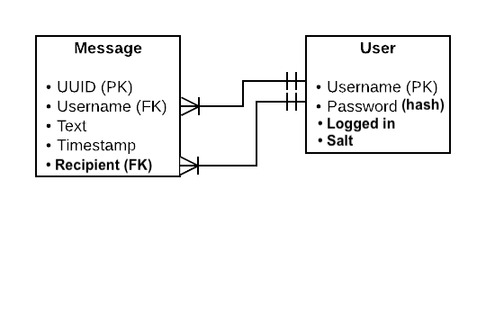

# SecureChat2020
Secure Chat app for Secure Programming 2020 course


# Documentation
The underneath text forms the documentation of the SecureChat program developed for the Secure Programming course of the Deep Programming minor academic year '20/'21. The software is developed in C. All functionality and design decisions are documented in here and are structured as follows:

	1. Architecture
	2. Server program
	3. Client program

## 1. Architecture
The software in its current state is structured as shown in figure 1. The figure shows roughly how the communication is set up in its current state. It consists of a the following components:

	1. Clients
	2. Workers
	3. Server
	4. SQLite3 Database

The server functions as a central point of communication between these components. It handles all incoming and outgoing messages and stores these in the SQLite3 database, so that they may be recalled whenever required. Once a client connects to the server by providing its address and port (see section 2 on the client program for usage), a worker process is forked off by the server to ensure the possibility of multiple clients. This worker process handles all communication with an individual client. For more information on the client to worker and worker to server communication, please see section 2 and 3 on the server and client programs. 


There are different types of communication present within this architecture, which can be described as follows:

Communication Type | Description
-------------------|-------------
Client <-> worker  | Communication over TCP socket
Worker <-> server  | Communication over File Descriptors
Server <-> database| Communication using SQL queries


## 2. Server Program
```
Usage:
	./server <port>
```

The server program serves as a central point of communication within the architecture. It is responsible for managing all incoming and outgoing communication and allows multiple clients to talk to each other over a centralized instance. While it does not handle incoming client messages directly itself, it is responsible for spawning new worker processes, enabling multiple workers to communicate with eachother, creating the database and so on. The server allows a total of 16 clients at once.

### 2.1 Worker Processes
As mentioned, the server is responsible for spawning worker processes that handle the incoming and outgoing client communication. Every time a client connects to the server address, the server forks off a child process that becomes a worker. This worker can communicate with the client over a TCP socket. Whenever the client sends a command or message, the worker process that corresponds to the sending client receives the message or command over the socket using the `api_recv()` function, after which it is executed appropriately using the `execute_request()` function (file `worker.c line 133`). This includes (but is not limited to) logging in, registering users and handling regular messages.

Whenever a regular message is received, the worker does not communicate this message directly with the server. Instead, it stores the message in the SQLite3 database with the `insert_global()` function (file `worker.c line 72`) and notifies the server using the `notify_workers()` function (file `worker.c line 53`) by writing over the bidirectional channel (file descriptor) that is set up between the server and worker process for notifications. The server in turn responds to this notification by setting the `pending` bit in a separate struct created for each worker process that is located in `server.c`. Each worker responds to this notification by executing the `handle_s2w_notification()` function (file `worker.c line 30`), in which they request the latest message in the database with an SQL query, of which the result is written back over the client's socket.


### 2.2 Creation of the database
In order for the workers to store messages in the database, the server must create this database if it does not exist yet. For now, this is done in the `main()` function of `server.c (line 372)`. The filename of the database is `chat.db` and consists of a table called `global_chat` with the following columns:

	- id (primary key)
	- Message

In the future, this could be expanded using a separate column for timestamp, username (foreign key) and chat ID (foreign key). The desired database layout is shown in figure 3 and allows for added security by salting user passwords if a separate user table is made and separate chat logs such as private chat messages.


 

## 3. Client Program
```
Usage:
	./client <server address> <server port>
```

The client program can be used by a user to connect to the server and send messages to other users. It does so by connecting to the server with a TCP socket, unaware of the presence of the worker processes. Its only concern is parsing user commands, writing its message over the socket and handling the response. In the future, an extra task will be added which involves the storing of other client's public keys for use. This is due when cryptography is implemented. Communication with the workers is done through the API-interface provided by the framework, which allows the client to store information about the message and send this to the server.

### 3.1 Command Parsing
For the parsing and handling of user commands, the client uses the file `ui.c`. This file contains all the possible user commands (also listed in table 1) and performs the necessary checks before executing them. Right now, the only functionality provided by parsing is the ability to set the state indicating a client is 'logged in' and exiting the program. Furthermore, empty messages are not allowed and a user is not allowed to send messages before being logged in.

Command | Description
--------|-------------
/login <username> <password>\* | Allow the user to log in
/register <username> <password>\* | Allow the user to register a new account, user is logged in automatically after registering
/users\* | Prints the amount of online users
/exit | Exits the client program

## 4. Security
Because this is only the first phase of development and requires the functionality only, no security implementations have been made so far. However, in order to ensure no vulnerabilities created are overlooked or forgotten, the list underneath is kept to ensure all vulnerabilities will be fixed before the third deadline. 

- [ ] Fix the SQL Injection vulnerability by parameterizing the query at `worker.c line 91`.
- [ ] Fix the double free bug in `worker.c` (yet to be located).
- [x] Fix the nullbyte injection vulnerability in `worker.c`.
- [ ] Fix the buffer overflow vulnerability on client input and worker handler with bounds-checking.


## Notes
In the commands table, a few commands are marked. These are commands that the client program will be able to parse, but of which the functionality has not actually been implemented yet. The login and register commands show very similar behaviour due to the abstraction of a user not being implemented yet. The users function returns a fixed message because of this exact reason.


# Assignment 1.B - Security by Design

## Use of Encryption
In the below image, an overview is given of the earlier presented architecture in combination with the applied encryption. There are, wherever required, two types of encryption used; a hybrid encryption scheme and an asymmetric encryption scheme. The hybrid encryption scheme is used for the messaging protocol and utilizes RSA (asymmetric) and AES (symmetric) to mitigate the overhead of using RSA only. Communication regarding key management can be done with asymmetric encryption only.


Section 1 on the architecture already displayed a few types of communication. The above figure applies the required cryptography scheme to each communication type. The legend shows which type is being used between the components. 

### Hybrid Encryption
First, the hybrid encryption scheme between client and worker is discussed. A hybrid encryption scheme is implemented by generating a symmetric key and symetrically encrypting the message. Then, the recipient's public key (obtained from the TTP) is used to encrypt the symmetric key, after which the encrypted message and the encrypted symmetric key are sent to the recipient. This overcomes the fact that RSA can only encrypt limited-size messages, creates some overhead in size after encryption and thus can be relatively expensive on small architectures. This type of encryption will be used for client to server or client to client communication.

### Asymmetric Encryption
Secondly, the asymmetric encryption scheme should be discussed. The reason that asymmetric encryption is chosen here, is because the key communication is mostly fixed and only has to make sure that the returned key by the TTP (or client/server) cannot be replaced or modified in transit. 

### No Encryption
Thirdly, some communication channels have no encryption. This is regarding the database connection and server/worker connection. This communication is not done through the transmission of data, hence, there is no encryption required for data in transit. The workers are merely forked child processes of the server and the database is accessed directly through SQL queries.
 
### Database Security
While data has to be secured in transit, it also has to be secured in rest. Or at least the sensitive parts of the data. This is why the sensitive information in the database, such as passwords, should be salted and hashed with the SHA-256 algorithm. We refrain from using slow hashes because we are of opinion that salting in combination with the SHA-256 algorithm is sufficient security and does not require the extra security coming with the performance overhead of a slow hash.

### Sender Verification
It is important to ensure the confidentiality and integrity of a message, but sometimes, the sender has to be verified as well. This can be done using signature verification (not shown in the figure). Before sending the message, the sender hashes the message and encrypts it with their private key. Then, the message (including the digital signature) is sent to the recipient, who may verify the sender by hashing the obtained message and decrypting the signature with the recipients public key. If the resulting hashes match, the sender is verified. This is implemented for all client to client communication.

## Key Management
In order to enable different parties to communicate with each other securely, some form of key management has to be achieved. This is done using a Trusted Third Party (TTP). This TTP is responsible for keeping all the public keys linked to users. Every connected party will be able to approach the TTP, ask for a certain public key, and use this public key to communicate with the user which has the corresponding private key. The implementation for the TTP will either be in Python3 or Bash. Clients can directly communicate with the TTP, as this creates less overhead and actually makes the attack surface smaller. Clients may not store the keys locally and have to query the TTP everytime they want to send a message, as it is undesirable to make the user responsible for their own security. The TTP is allowed to read and modify the serverkeys and clientkeys directory.

## Security Properties

The Threat model which affects our project has the following capabilities:

Threat Model | 
--------|
Determine at which addresses all clients and the server are running.| 
Read, modify, inject, and/or block data sent over any network connection between a client and the server.| 
Establish a connection with any client or the server, spoofing her network address to any possible value.|
Implement a malicious client to attack either the server or other clients by sending specially crafted data. |
Implement a malicious server and get clients to connect to it instead of the intended server, to attack clients by sending specially crafted data.|
Perform these actions any number of times, possibly simultaneously.|

### Our Security Measures

In this section we will describe how our secure design implementation will protect the client data and application against the capabilities of the threat model, Mallory.

##### 1. Determine at which addresses all clients and the server are running
The threat actor, Mallory, has the ability to find out the address of both the clients and server or already knows them. In our design of the application we will secure all the communication channels between client, server and Trusted Third Party (TTP) using a hybrid encryption. Hence, even if Mallory knows the addresses of the clients and server, she will not able to see the communication between them.  

This coincides with the following security properties described in Section 7.2:
•Mallory cannot get information about direct messages for which she is not either the sender or the intended recipient.

##### 2. Read, modify, inject, and/or block data sent over any network connection between a client and the server.
The threat actor has the ability to intercept a communication and modify, read, inject and/or block data over the network. As mentioned in the previous capability the communication and data sent between the client and server will be encrypted. Therefore, Mallory will be able to read just the cyphertext and not the actual plaintext of the message, which does not disclose any information. 
When it comes to injecting and modifying the data sent by the client or server will result in the cyphertext being modified. By doing so, when the recipient receives the message and tries to decrypt it, it will fail. Resulting in dropping the actual data/package. 
The only capability which Mallory can perform is blocking the message itself, which our program does not solve. However, in this assignment it is not required to provide availability, thus, it will not be considered.

This coincides with the following security properties described in Section 7.2:
• Mallory cannot get information about direct messages for which she is not either the sender or the intended recipient.
• Mallory cannot send messages on behalf of another user.
• Mallory cannot modify messages sent by other user
##### 3. Establish a connection with any client or the server, spoofing her network address to any possible value.
Mallory will be able to connect with a client or server, by spoofing her network address to any possible value.
In our design we will check the identity of each sender by using digital signatures. The logic behind it is at follows: We will embed in each message send a digital signature created by a hashing algorithm (in our case SHA256) and encrypting it with the sender private key. When it reaches the recipient, he will hash the message and decrypt the cypher text. Then, check if the two values of the two hashes are the same. If not, the message was not sent by the actual sender. Hence, the it will be dropped.

This coincides with the following security properties described in Section 7.2:
•Mallory cannot get information about direct messages for which she is not
either the sender or the intended recipient.
• Mallory cannot send messages on behalf of another user.

##### 4. Implement a malicious client to attack either the server or other clients by sending specially crafted data.
The threat actor is able to create a malicious client to attack either the server or client with specially crafted data.
Our design of the application will perform data escaping and sanitization, on the server and client side, which will disallow any incorrect or abnormal input. Furthermore, our design will perform error handling which will inform the user of their mistake without exposing any unwanted information.

This coincides with the following security properties described in Section 7.2:
•Mallory cannot find out users’ passwords or private keys (even if the server is compromised).
• Mallory cannot use the client or server programs to achieve privilege escalation on the systems they are running on.
• Mallory cannot leak or corrupt data in the client or server programs.
• Mallory cannot crash the client or server programs.
• The programs must never expose any information from the systems they run on, beyond what is required for the program to meet the requirements in the assignments.
    
##### 5. Implement a malicious server and get clients to connect to it instead of the intended server, to attack clients by sending specially crafted data.
The threat actor is able to create a malicious server to get clients to connect to it and send specially crafted data to them.
Our design of the application will perform data escaping and sanitization, on the server and client side, which will disallow any incorrect or abnormal input. Furthermore, our design will perform error handling which will inform the user of their mistake without exposing any unwanted information.

This coincides with the following security properties described in Section 7.2:
•Mallory cannot find out users’ passwords or private keys (even if the server is compromised).
• Mallory cannot use the client or server programs to achieve privilege escalation on the systems they are running on.
• Mallory cannot leak or corrupt data in the client or server programs.
• Mallory cannot crash the client or server programs.
• The programs must never expose any information from the systems they run on, beyond what is required for the program to meet the requirements in the assignments.

##### 6. Perform these actions any number of times, possibly simultaneously.
The threat actor can perform all the capabilities at the same time, possibly simultaneously.
The design of our program will handle each of these malicious actions as described above.
All in all, our secure design mainly provides two out of the CIA TRIAD, Confidentiality and Integrity, as Availability is not required in this assignment.


